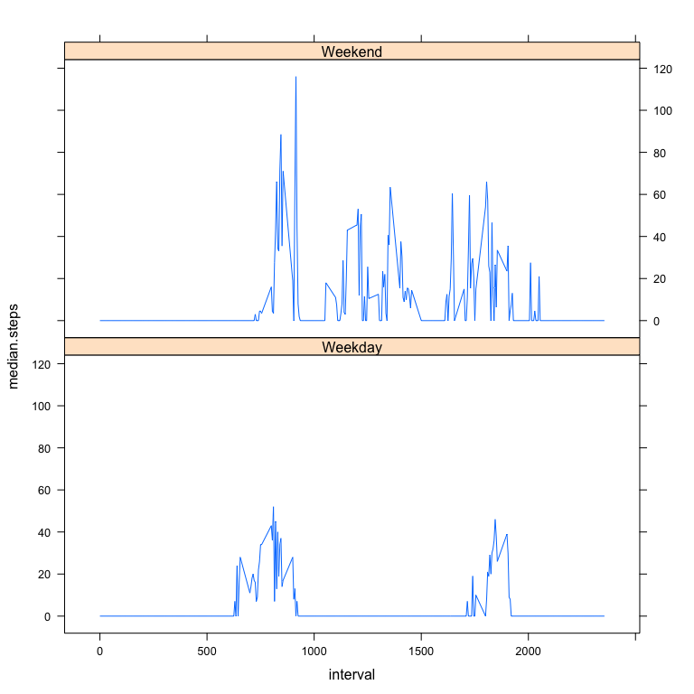

# Reproducible Research: Peer Assessment 1


## Loading and preprocessing the data

Unzip and load the data. Convert date to date type and create a factor for interval. Finally, created a filtered set that ignores the rows without steps recorded.  

```r
library(data.table)
if(!file.exists("./activity.csv")){
   unzip("./activity.zip")
}
input = read.table("./activity.csv",
    comment.char = "#",
    header = TRUE,
    sep = ",",
    na.strings = "NA")
input$date = as.Date(input$date)
input$interval.factor = factor(input$interval)
valid.input = input[complete.cases(input),]
```

## What is mean total number of steps taken per day?

Create summary table of total steps per day, then create a histogram:  

```r
library(plyr)
steps.per.day = ddply(valid.input, "date", summarize, total.steps = sum(steps))
with(steps.per.day,hist(total.steps,breaks=10))
```

 

What is the mean number of steps per day?  

```r
mean(steps.per.day$total.steps)
```

```
## [1] 10766
```

What is the median number of steps per day?

```r
median(steps.per.day$total.steps)
```

```
## [1] 10765
```

## What is the average daily activity pattern?

Create time series plot:  

```r
steps.per.interval = ddply(valid.input,"interval",summarize, median.steps = median(steps))
plot(steps.per.interval$interval,steps.per.interval$median.steps, type="l",main="steps by time interval")
```

 

```r
#attempt to use factors for better spacing broke the line expectation, so keeping plot as int
```

Which interval has the most steps on average? 845 has 60 step max median  

```r
steps.per.interval[steps.per.interval$median.steps == max(steps.per.interval$median.steps),]
```

```
##     interval median.steps
## 106      845           60
```

## Imputing missing values
How many missing values are there in total?  

```r
sum(is.na(input$steps))
```

```
## [1] 2304
```

We need to understand the pattern of NAs, before determining how to fill them in.  

```r
na.per.interval = ddply(input,"interval",summarize, count.na = sum(is.na(steps)))
plot(na.per.interval)
```

 

```r
na.per.date = ddply(input,"date",summarize,count.na = sum(is.na(steps)))
plot(na.per.date)
```

 

```r
input$is.na = is.na(input$steps)
pairs(input)
```

 

Pattern of missing data and the pattern within the time series suggests that average by interval would be a better way to impute values than by date; however, using the average by day of week AND by interval will be even better.

Next, compute the imputed values using the average value for the day of week and interval:


```r
#discover average by day of week and interval
valid.input$dow = weekdays(valid.input$date,abbreviate=TRUE)
steps.imputed = ddply(valid.input,.(interval,dow),summarize, median.steps = median(steps))
steps.imputed$merge.key = paste(steps.imputed$dow,steps.imputed$interval)
#merge with input to create imputed data
input$dow = weekdays(input$date,abbreviate=TRUE)
input$merge.key = paste(input$dow,input$interval)
imputed.data = merge(input,steps.imputed)
imputed.data$steps[is.na(imputed.data$steps)] = imputed.data$median.steps[is.na(imputed.data$steps)]
```

Now, to repeat the histogram, mean & median plots using the newly imputed data  

```r
steps.per.day = ddply(imputed.data, "date", summarize, total.steps = sum(steps))
with(steps.per.day,hist(total.steps,breaks=10))
```

 

Mean:  

```r
mean(steps.per.day$total.steps)
```

```
## [1] 9705
```

Median:  

```r
median(steps.per.day$total.steps)
```

```
## [1] 10395
```

Are they different? Yes, missing data may be masking many days with steps on the low end of the histogram.

This results in both a lower mean and median steps per day. This could be caused by not wearing or turning on the device on days of lower activity.

## Are there differences in activity patterns between weekdays and weekends?

Split the data into factors for weekday v weekend, then create time series plot.  

```r
valid.input$daytype[valid.input$dow == "Sat" | valid.input$dow == "Sun"] = "Weekend"
valid.input$daytype[is.na(valid.input$daytype)] = "Weekday"
valid.input$daytype = factor(valid.input$daytype)
library(lattice)
steps.per.daytype.interval = ddply(valid.input,.(interval,daytype),summarize, median.steps = median(steps))
xyplot(median.steps ~ interval | daytype,
       type="l",
       data = steps.per.daytype.interval,
       layout = c(1,2))
```

 

```r
#attempt to use interval factors for better spacing broke the line expectation, so keeping plot as int
```

